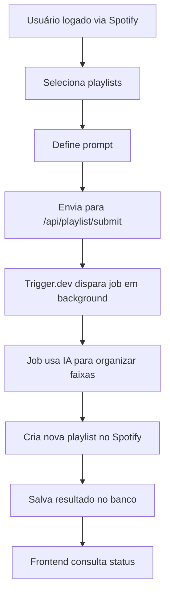
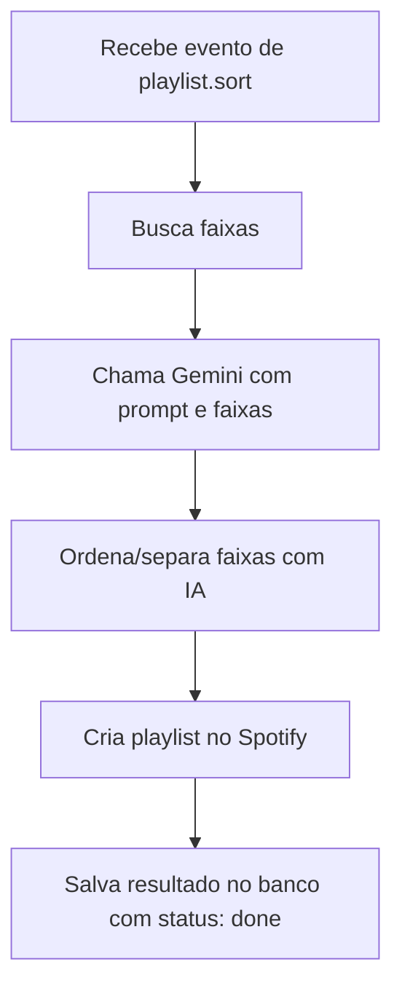
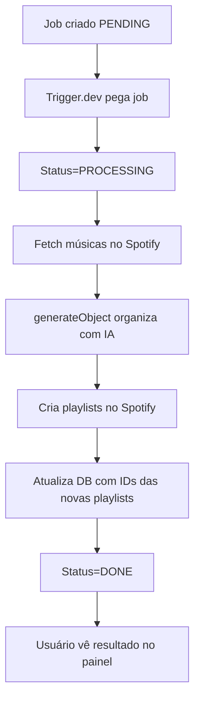

# 🔄 Fluxo resumido da aplicação (diagrama 1)

```mermaid
graph TD
  A[Usuário logado via Spotify] --> B[Seleciona playlists]
  B --> C[Define prompt]
  C --> D[Envia para /api/playlist/submit]
  D --> E[Trigger.dev dispara job em background]
  E --> F[Job usa IA para organizar faixas]
  F --> G[Cria nova playlist no Spotify]
  G --> H[Salva resultado no banco]
  H --> I[Frontend consulta status]
```

# 🧠 Fluxo do Job Trigger.dev (diagrama 2)

```mermaid
graph TD
  A[Recebe evento de playlist.sort] --> B[Busca faixas]
  B --> C[Chama Gemini com prompt e faixas]
  C --> D[Ordena/separa faixas com IA]
  D --> E[Cria playlist no Spotify]
  E --> F[Salva resultado no banco com status: done]
```

```mermaid
graph TD
  A[Job criado PENDING] --> B[Trigger.dev pega job]
  B --> C[Status=PROCESSING]
  C --> D[Fetch músicas no Spotify]
  D --> E[generateObject organiza com IA]
  E --> F[Cria playlists no Spotify]
  F --> G[Atualiza DB com IDs das novas playlists]
  G --> H[Status=DONE]
  H --> I[Usuário vê resultado no painel]
```